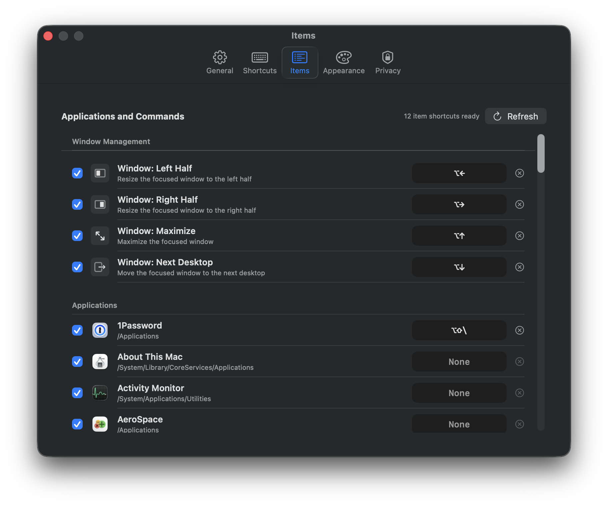

# Nova Launcher

A macOS-first productivity launcher inspired by Raycast. The first version
focuses on local app launching through a keyboard-first command palette.

## Screenshots




## Features

- Option-Space global launcher hotkey
- Fast local app index for `/Applications`, `/System/Applications`, and user apps
- Fuzzy app and command search with arrow-key navigation and Return-to-open
- Direct web URL opening in the default browser, including domains without a scheme
- Basic focused-window commands for left half, right half, maximize, and next desktop
- Menu bar utility with reindex, settings, and quit actions
- Native Settings window for launch-at-login, theme, and shortcut customization
- Dark, light, and system appearance modes
- Local-only indexing; no network service or remote search

## Run

```bash
./script/build_and_run.sh
```

The script builds the SwiftPM target, stages `dist/NovaLauncher.app`, and opens
the app bundle as a foreground macOS application.

## Install with Homebrew

The Homebrew cask lives in `suho/homebrew-tap`. Tagged releases publish a
versioned app zip and automatically update the cask checksum.

Prerequisites:

- macOS Tahoe 26.0 or newer
- Homebrew
- Xcode Command Line Tools with Swift 6.2 or newer

Install without manually tapping the repo:

```bash
brew install --cask suho/tap/nova-launcher
```

If you previously tapped this repository directly, remove the old tap first:

```bash
brew untap suho/nova-launcher
```

To upgrade:

```bash
brew upgrade --cask suho/tap/nova-launcher
```

To uninstall:

```bash
brew uninstall --cask suho/tap/nova-launcher
```

## Release

The release workflow runs when a `v*` tag is pushed. It builds the app on
GitHub Actions, signs and notarizes the app, creates a GitHub release with
`NovaLauncher-<version>.zip`, computes the SHA-256 checksum, and dispatches
`suho/homebrew-tap` to update the cask.

The `suho/nova-launcher` repository must have these secrets:

- `MATCH_GIT_URL`: private fastlane match repository URL.
- `MATCH_PASSWORD`: fastlane match encryption password.
- `MATCH_GIT_BASIC_AUTHORIZATION`: optional HTTPS credential for the match repo,
  base64-encoded as `username:token`.
- `MATCH_GIT_PRIVATE_KEY`: optional SSH private key contents for the match repo.
- `APPLE_ID`: Apple ID email used for notarization.
- `APPLE_TEAM_ID`: Apple Developer team ID.
- `APPLE_APP_SPECIFIC_PASSWORD`: app-specific password for notarization.
- `HOMEBREW_TAP_TOKEN`: fine-grained GitHub token scoped to `suho/homebrew-tap`
  with Contents read/write permission.

The match repository must already contain a Developer ID Application
certificate. CI runs `fastlane match developer_id --readonly` and only installs
existing signing assets. For a private match repository, provide either
`MATCH_GIT_BASIC_AUTHORIZATION` or `MATCH_GIT_PRIVATE_KEY`.

```bash
git tag v0.1.0
git push origin v0.1.0
```

After adding or rotating signing secrets, run the release workflow manually with
an existing tag to replace that release asset and update the tap checksum.
