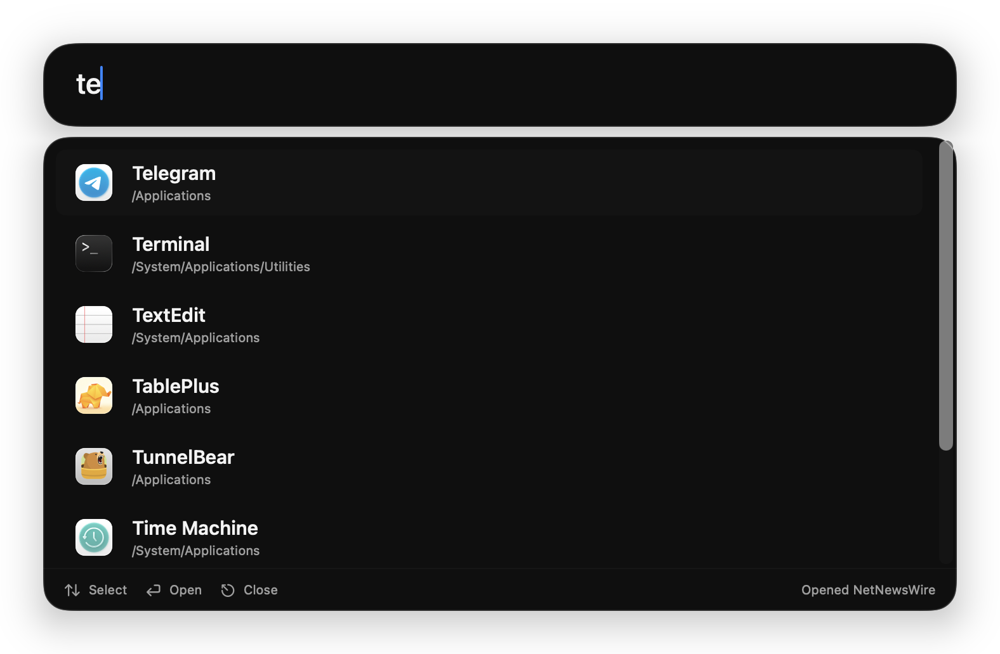

# Nova Launcher

A macOS-first productivity launcher inspired by Raycast. The first version
focuses on local app launching through a keyboard-first command palette.

## Screenshots




## Features

- Option-Space global launcher hotkey
- Fast local app index for `/Applications`, `/System/Applications`, and user apps
- Fuzzy app and command search with arrow-key navigation and Return-to-open
- Basic focused-window commands for left half, right half, maximize, and next desktop
- Menu bar utility with reindex, settings, and quit actions
- Native Settings window for launch-at-login, theme, and shortcut customization
- Dark, light, and system appearance modes
- Local-only indexing; no network service or remote search

## Run

```bash
./script/build_and_run.sh
```

The script builds the SwiftPM target, stages `dist/NovaLauncher.app`, and opens
the app bundle as a foreground macOS application.

## Install with Homebrew

The Homebrew cask lives in `suho/homebrew-tap` and builds the app locally from
the latest `main` branch.

Prerequisites:

- macOS Tahoe 26.0 or newer
- Homebrew
- Xcode Command Line Tools with Swift 6.2 or newer

Install without manually tapping the repo:

```bash
brew install --cask suho/tap/nova-launcher
```

If you previously tapped this repository directly, remove the old tap first:

```bash
brew untap suho/nova-launcher
```

Because the cask uses `version :latest`, use `--greedy` when upgrading:

```bash
brew upgrade --cask --greedy suho/tap/nova-launcher
```

To uninstall:

```bash
brew uninstall --cask suho/tap/nova-launcher
```
